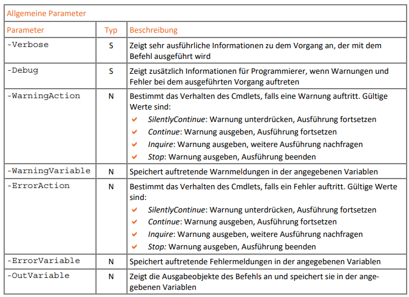
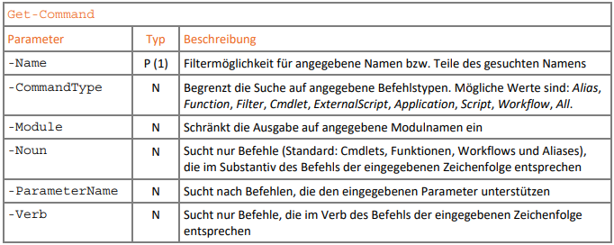
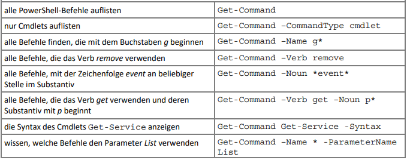

# Cmdlets

- Powershell Befehle
- Aufbau: `Verb-Noun -Parameter [value]`
- NICHT case-sensitiv

---

## Parameter

3 Varianten

- benannt
  - `Get-Command -Noun Process`
- switch (Schalter)
  - `Get-ChildItem -Recursive`
- Position
  - Parameterreihenfolge vorgegeben - Parameterbezeichner ist optional
  - `Get-Process -Name pwsh` oder `Get-Process pwsh`
  - von Befehl zu Befehl unterschiedlich

---

### Allgemeine Parameter

> common parameter

- gibt es bei jedem Cmdlet
- "basics"

N ... named / S ... switch

---

#### Sicherheits-Parameter

- `-WhatIF` ... (switch) Die Anweisung wird"simuliert". Eine Meldung beschreibt die Auswirkungen.
  - `Stop-Process –Name pwsh –WhatIf`
- `-Confirm` ... (switch) Fordert vor der Ausführung jeder Aktion zur Bestätigung auf.

---

## Beispiele

### `Get-Command`

---

#### `Get-Command` Anwendung

---

### Einsteiger Cmdlts

- `Get-Help` ... Hilfestellung zu anderen Cmdlets
- `Get-ChildItem` ... Verzeichnisinhalt
- `Get-Date` ... Datums- und Uhrzeitangaben
- `Get-History`... Liste der zuletzt eingegebenen Befehle
- `Get-Module`  ... geladene PowerShell-Module
  - Parameter  `-ListAvailable` alle verfügbaren (noch nicht geladenen) Module anzeigen
- `Get-NetIPAddress`  .. Informationen zur IPv4- und IPv6-Adressierung
- `Get-Process` ... Liste der aktiven Prozesse
- `Get-Service` ... Liste der Dienste
- `Get-PSDrive` ... Zeigt die PowerShell-Laufwerke an

---

### `Show-Command`

> Win only(?)

- Eigenes Fenster mit Formular zum "ausfüllen" eines Befehls
- Gut für Einsteiger (auch in Powershell ISE zu finden)
- Bsp: `Show-Command –Name Get-Command`

---

## Exercises

1. Hilfe aktualisieren / herunterladen: `Update-Help -UICulture en-US -Force`
2. Finde heraus, welche Cmdlets den Parameter `–Verb` verwenden. Lese in der Hilfe zu einem der  angezeigten Cmdlets nach, was der Parameter bedeutet.
3. Finde heraus, welche Befehle das Verb `Import` verwendet.
4. Lies die vollständige Hilfe zu `Get-PSDrive` und `Get-PSProvider`
