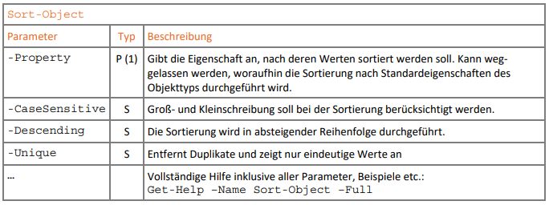
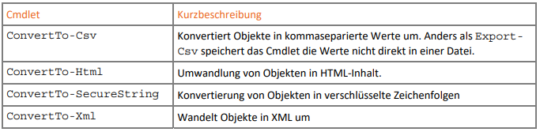

# Pipeline - `|`

> Cmdlet Verknüpfung / Befehlskette

---

## Prinzip


---

## Object-Cmdlets - Datenverarbeitung

- benötigen Daten aus Pipeline
- Liste: `Get-Command -Noun Object`
- Mini-Exercise: Hilfe (Beispiele) für `Select-Object` ansehen

---

### Übersicht Object-Cmdlets


---

### `Select-Object`


P(1) ... Positionsparameter / N ... named / S ... switch

```powershell
Get-Process –Name powershell 
Get-Process –Name powershell | Select-Object –Property Name, Id
Get-Process –Name powershell | Select-Object –Property *

"Batman", "Robin", "Batman", "Superman", "Batman", "Superman" | Select-Object -Unique 
```

---

### `Sort-Object`



```powershell
Get-ChildItem C:\Windows -File | Sort-Object –Property Extension, Length 
```

---

### `Where-Object`


```powershell
# old style
Get-Service | Where-Object { $_.Status -EQ "Running" }
# new style
Get-Service | Where-Object Status -EQ Running
# too long? double combo!
Get-Service | Where-Object Status -EQ Running | Select-Object -First 10

Get-ChildItem -Path C:\Windows -File | Where-Object Length -LT 100KB

# -AND / -OR combos - best with old style
Get-ChildItem -Path C:\Windows -File | `
  Where-Object {$_.Length -LT 100KB -AND $_.Length -GT 50KB }
   
Get-ChildItem -Path C:\Windows -File | `
  Where-Object { $_.Length -LT 100KB -OR $_.Length -GT 1MB } 

```

- *Das aktuell verarbeitete Objekt wird durch die Zeichenfolge `$_` angesprochen!*
- *Backtick ` für mehrzeilige Eingabe* (vermeiden, schlecht für cmd history)


---

### `ForEach-Object`


```powershell
#ping
1..3 | ForEach-Object {Test-Connection 127.0.0.$_ -Count 1 } 
# with "begin and end"
1..3 | ForEach-Object `
  -Begin { Clear-Host; Write-Host "let`s ping:" } `
  -Process { Test-Connection 127.0.0.$_ -Count 1 } `
  -End { Write-Host "done!" } 
```

---

### `Measure-Object`


```powershell
# statistics
7, 3, 5, 22, -5, 4, 11, 17, 2 | Measure-Object -Average -Sum -Maximum –Minimum

# size of files in win-folder
Get-ChildItem -Path C:\Windows | Measure-Object –Property Length -Sum
```

---

## Ausgabe

3 Varianten: `Out-`, `Export-`, `ConvertTo-`

### `Out-`


```powershell
# to file - without override
Get-Process | Out-File –FilePath C:\tmp\process.txt -NoClobber
# to table
Get-Process | Out-GridView
```

---

### `Export-`


```powershell
# XML (I am no fan of that)
Get-Process -Name pwsh | Export-Clixml –Path .\ps-process.xml
# lets look at the ugly result
code .\ps-process.xml
```

- XML sorgt für große Dateien
- CSV kompakter... 

---

#### `Export-Csv`


```powershell
# woohoo! double pipe!
Get-Process –Name powershell | Select-Object Company, Description, Id, StartTime | ` Export-Csv -Path .\ps-process.csv –Delimiter ";"
```

---

### `ConvertTo-`

> Konvertierung ohne in Datei zu schreiben.



#### `ConvertTo-SecureString`

```powershell
# direct string conversion
$sec = ConvertTo-SecureString -String "SuperSecretString" -AsPlainText -Force
# convert user input
$sec2 = ConvertTo-SecureString -String (Read-Host [–AsSecureString]) -AsPlainText -Force
# plain text again
ConvertFrom-SecureString -SecureString $sec2 -AsPlainText
```

---

## Exercises

1. JSON ist ein wichtiges Datenformat - Erzeuge beliebige Daten (z.B. mit `Get-Process`) und speichere das Resultat in einer `.json`-Datei. (TIP: suche nach JSON Befehlen mit Hilfe von `Get-Command`).

2. Beschreibe was bei der folgenden Pipeline passiert:

   ```powershell
   Get-ChildItem –Path C:\Windows\*.exe | `
     Where-Object { $_.Length –gt 20kb } | `
     Select-Object –Property Length, Name | `
     Sort-Object –Property Length –Descending | `
     ConvertTo-Html -Body "<h1>Win Exes</h1>" | `
     Set-Content –Path .\exe.html
   ```

3. Sortiere den Verzeichnisinhalt des Windows-Verzeichnisses (nur Dateien) absteigend nach Größe und  exportiere das Ergebnis in die CSV-Datei winfiles.csv im aktuellen Verzeichnis.
4. Wie viele Dateien mit der Erweiterung `.exe` weist dein Windows-Verzeichnis auf?  Wie groß sind diese Dateien insgesamt und durchschnittlich?

