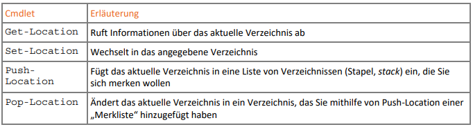
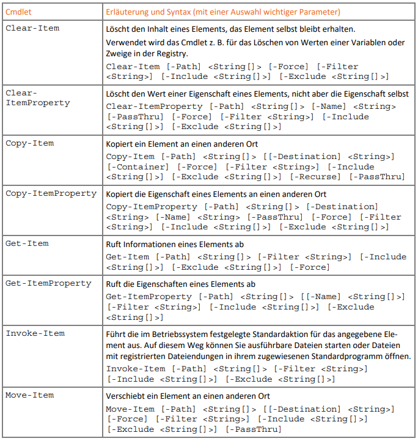
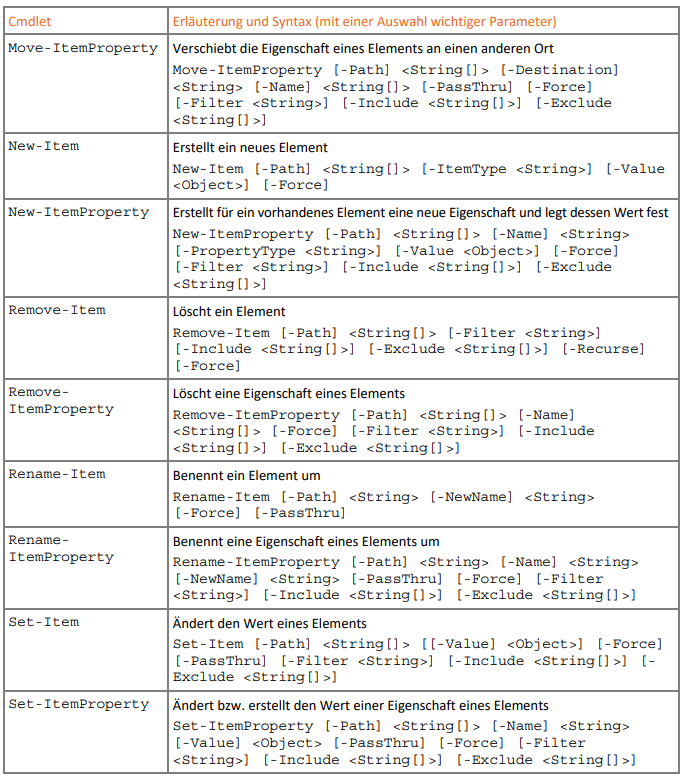
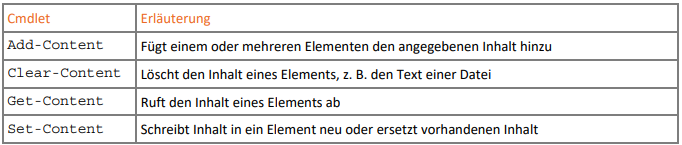

# Provider - Datenspeicher in PowerShell

- PowerShell-Provider 
  - fassen Objektmengen zu Thema zusammen
  - **Navigation wie durch Laufwerke**
- Wichtige Provider:
  - `Alias` ...  Datenspeicher für alternative Kurzbefehle
  - `Environment` ...  Datenspeicher für Umgebungsvariablen
  - `FileSystem` ... Datenspeicher für das Dateisystem (Laufwerke, Freigaben)
  - `Function` ... Datenspeicher für das Funktione
  - `Registry` ... Datenspeicher für (zwei) Hauptschlüssel der Windows-Registry
  - `Variable` ... Datenspeicher für Variablen

```powershell
# get.. as always
Get-PSProvider
# drives
Get-PSDrive
```

---

## Laufwerke - `Get-PSDrive`

- `Get-PSDrive` zeigt folgend Laufwerkstypen:
  - logische Laufwerke, Netzwerkfreigaben
  - Windows-Registry (HKEY_CURRENT_USER und HKEY_LOCAL_MACHINE)
  - Provider-Laufwerke (Alias, Function, Env, ...)
  - Mit `New-PSDrive` erzeugte Laufwerke

```powershell
# our powershell working directory
New-PSDrive –Name PsWork –PSProvider FileSystem –Root C:\Users\<yourname>\pwsh -Persist
# Set-Location (alias: cd)
Set-Location PsWork:\
# you don't like that drive?
Remove-PSDrive –Name PsWork –Force
```

---

## Arbeiten mit Verzeichnissen



```powershell
# some examples
Get-Location –PSProvider Registry
Get-Location –PSDrive HKLM
```

---

### Arbeiten mit Elementen (`Items`) von Verzeichnissen

- Elemente gelten für alle `PS-Drives`!!
- `Items` können Verzeichnisse, Dateien, Registry_Keys usw. sein!

- Auflistung `Get-Command -Noun Item*` oder noch mehr: `Get-Command -Noun *Item*`

#### Eine "kleine" Selektion





---

Selektion zu lang? Ok, dann lieber ein paar ...

#### Beispiele

```powershell
# new & invoke
New-Item .\fake.exe; Invoke-Item –Path .\fake.exe 
New-Item .\rechnung.xlsx; Invoke-Item .\rechnung.xlsx
# junk? remove them
Remove-Item -Path .\*.xlsx
# remove as pipe!
Get-ChildItem -Path . -Include *.exe | Remove-Item
# itemtype
New-Item .\a_dir -ItemType Directory
# copy
Copy-Item -Path . -Destination .\a_dir -Recurse
# oops, better press `Ctrl+C` fast or dont use -Recurse at all!
# want to see the subfolders:
explorer .
# better get rid of that stuff
Remove-Item -Path ./a_dir -Recurse
# properties
New-Item .\test.txt -ItemType File
Get-ItemProperty –Path .\test.txt | Select-Object -Property *
# readonly
Set-ItemProperty –Path .\test.txt –Name IsReadOnly –Value $true
```

---

### Inhalte (`Content`) von Dateien



```powershell
Get-Content –Path .\test.txt
# empty? lets fill it up a bit
Set-Content -Path .\test.txt -Value "Some text!"
Add-Content -Path .\test.txt -Value "More text!"
Get-Process | Select-Object –Property Id, Name | Add-Content -Path .\test.txt
```

---

### Registry-Hacks (WIN only)

- Mit Vorsicht zu genießen! 
- Für HKLM PowerShell Console als Admin starten!

```powershell
# registry entries - use with care!
Set-Location -Path HKCU:\SOFTWARE
New-Item -Path "HKCU:\SOFTWARE\MyCoolSoftware" -ItemType Container
New-ItemProperty .\MyCoolSoftware -Name Version -Value "0.1" -PropertyType String
New-ItemProperty -Path .\MyCoolSoftware -Name HexVal -Value 0xA -PropertyType DWORD
Set-ItemProperty .\MyCoolSoftware -Name Version -Value "0.2"
Get-Item .\MyCoolSoftware
# or with registry editor
regedit
# lets clean up
Remove-Item .\MyCoolSoftware -Recurse
```

---

## Umgebungsvariablen - `Env`

> "hands-on":

```powershell
# all env vars
Get-ChildItem –Path Env:\
# specific ones (as variables)
$Env:PATH
$Env:USERPROFILE
# enter the lions den:
Set-Location Env:\
# Alias for Get-ChildItem
ls
```

---

## Exercises

> Try out the stuff above...