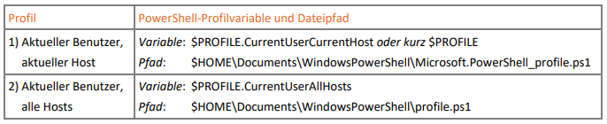
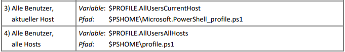
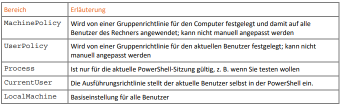
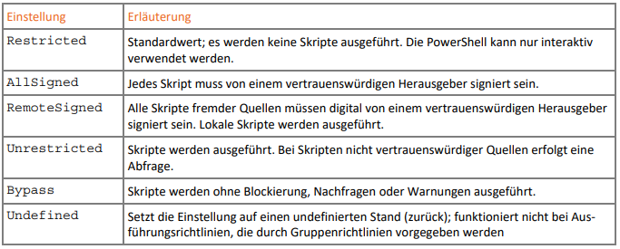

# Alias and Profile

## Alias

- Alternative Kurzbefehle
- Es stecken die klassichen Cmdlets mit `Verb-Noun` dahinter
- Liste: `Get-Alias` oder `Set-Location`
- gestohlen von linux und windows commandline
- Beispiele:  `cat, cd, cp, dir, echo, kill, ls, man, mv, pwd, ren, ...`
- Beachte: Ausgabe und Parameter sind anders als bei den "Klassikern"
  - z.B. `ls`
- Eigene Abkürzungen können erstellt werden: `New-Alias`

---

## Profile

- "Basis-Einstellungen" für jede PowerShell Session in Form einer Profil-Datei
  - Definition eigener Aliase
  - Einrichtung der Arbeitsumgebung wie z.B.
    - Festlegung von Farben
    - Definition eines eigenen Prompts 
  - Anlegen eigener Laufwerke
  - Importieren häufig verwendeter Module
  - Definition häufig verwendeter Variablen und Funktionen

---

### Profildateien

> sortiert nach Rangfolge





- `$HOME` ... User-Home
- `$PSHome` ... Installationsverzeichnis PowerShell
- müssen nicht existieren, sondern werden bei Bedarf selbst angelegt:
  - `New-Item –Path $PROFILE.CurrentUserCurrentHost -Type file -Force`

---

### Ausführungsrichtline (`ExecutionPolicy`)

> **Standardmäßig ist die Ausführung von Skripten eingeschränkt!** - Security

```powershell
# current policy
Get-ExecutionPolicy
# full list
Get-ExecutionPolicy -List
# set policy
Set-ExecutionPolicy -ExecutionPolicy RemoteSigned -Scope CurrentUser
```

---

### Anwendungsbereiche (`Scope`)



---

### Einstellungen



