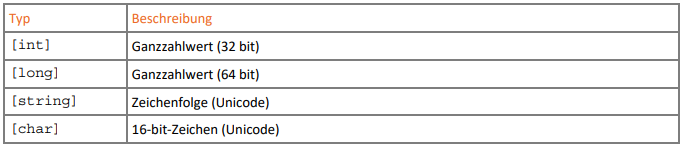
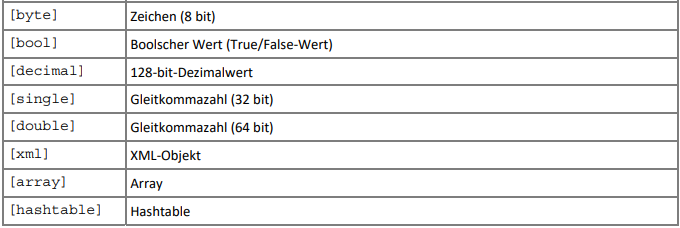
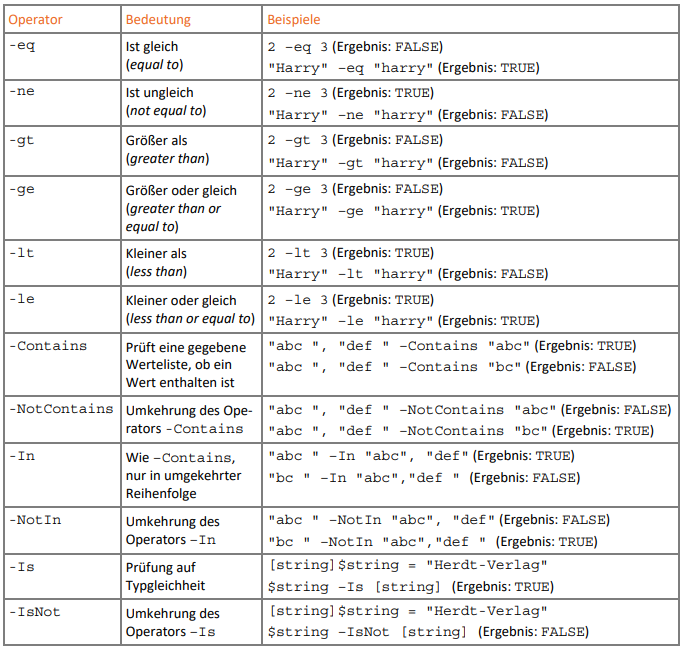
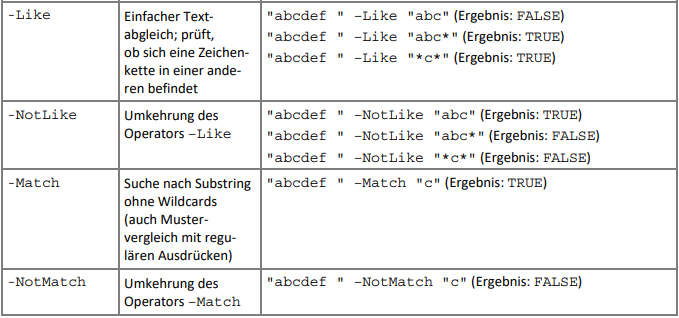
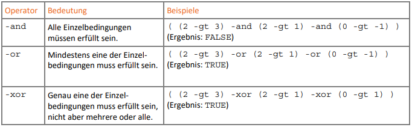

# Programming - Basics

## Übersicht

- Variablen
- Operatoren
- Kontrollstrukturen
  - Verzweigungen
  - Schleifen

---

## Variablen

- Variablen sind mit Dollar-Zeichen angegeben (vorangestellt)
  - auch bei Deklaration!
- NICHT Case-Sensitve!
- Typen:
  - Einstellungsvariablen `Get-Help about_Preference_Variables`
    - Bsp: `$ErrorActionPreference, $MaximumHistoryCount, $WhatIfPreference`
  - Automatisch `Get-Help about_Automatic_Variables`
    - Bsp: `$?` (Status des letzten Befehls), `$Error` (Fehler-History), `$HOME, $PSHOME`
  - Benutzerdefiniert

---

### Benutzerdefinierte Variablen

- nur für die aktuelle Sitzung gültig
- meist in Scripts in Verwendung
- automatische Typisierung oder auf Wunsch typisiert

```powershell
# list
Get-Variable
Get-ChildItem –Path Variable:
# examples
$var = 42.0
Write-Host $var
New-Variable –Name a_str –Value "This is a string!"
$mult = (42*2.0)
$mult
Remove-Variable -Name mult

$date = Get-Date
$date
$date | Format-List –Property *
```

---

### Variablen Typisierung





```powershell
[int]$answer = 42
# automatic cast
[int]$num = "23"
```

---

### Arrays

Gleich mit Beispielen:

```powershell
# different types allowed
$arr = 2, "abc", -29, 3.141596

# with @()-Operator
$a1 = @()
$a2 = @(1,2,"x")
$a3 = @(Get-Process –Name svchost)
$a3.Count

# change and add items
$a1 += 19 #append
$a2[1] = 3 #index
$a2.SetValue(25,2) #method
```

---

### Konstanten

wieder mit Beispiel:

```powershell
New-Variable -Name PI -Value 3.14159265 -Option Constant
```

---

### Operatoren

- Arithmetische Operatoren - gleich wie z.B. in C#
  - `+ - * / %`
    - `+` auch für Strings!
  - `++ --` als Post- und Präinkrement und -dekrement
  - `= += -= *= /=` Zuweisungen

- Vergleichsoperatoren sind PowerShell spezifisch:
  - `-eq -ne -gt -ge -lt -le` usw.
  - mit `c` am Anfang Case-Sensitiv, z.B: `-ceq`

---

#### Vergleichsoperatoren

Eine "kurze" Auflistung:





---

#### Verknüpfungsoperatoren



---

## Kontrollstrukturen

### Verzweigungen

Gleich als Beispiele:

```powershell
# IF
If ($x –gt 27) { 
  Write-Host "greater than 27." 
} 
ElseIf ($x –eq 27) { 
  Write-Host "exactly 27." 
} 
Else { 
  Write-Host "does not exist or less than 27." 
}

# SWITCH (break is optional)
Switch ($x) { 
 1 { Write-Host "X = 1"; break } 
 2 { Write-Host "X = 2" } 
 3 { Write-Host "X = 3" } 
 Default { Write-Host "X not 1,2,3 or not set." } 
} 
```

---

### Schleifen

- 4 Varianten:
  - `While`
  - `Do-While` und alternativ `Do-Until`
  - `For`
  - `ForEach` (z.B. bei Arrays)
- Abbruch der Schleife: `break` 
- Sprung zu nächstem Durchlauf: `continue`

Beispiele:

```powershell
# WHILE
$i = 0 
While ($i –le 3) { 
  Write-Host $i; $i++
}

# DO-UNTIL
$i=0
Do { 
 $i; $i++
} 
Until ($i –eq 3)

# FOR (ping example)
For ($i = 1; $i -le 5; $i++) { 
 Test-Connection -ComputerName 127.0.0.$i -Count 1 
} 

# FOREACH (simple)
$array = 2, 4, 6, 8, 10 
ForEach ($wert in $array) { $wert * 5 }

# FOREACH (begin - loop - end)
Get-Process | ForEach {$count = 0} {$_.Name; $count++} {"Total: $count processes."}
```
